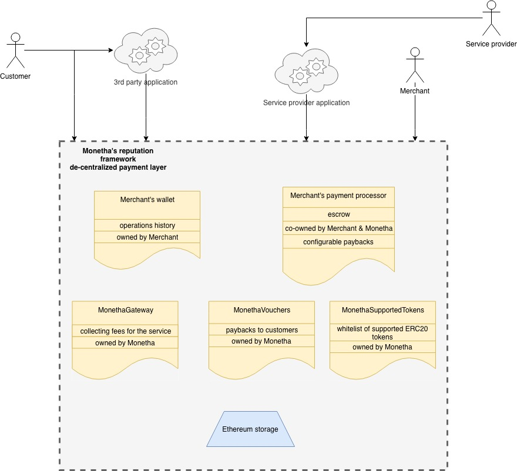
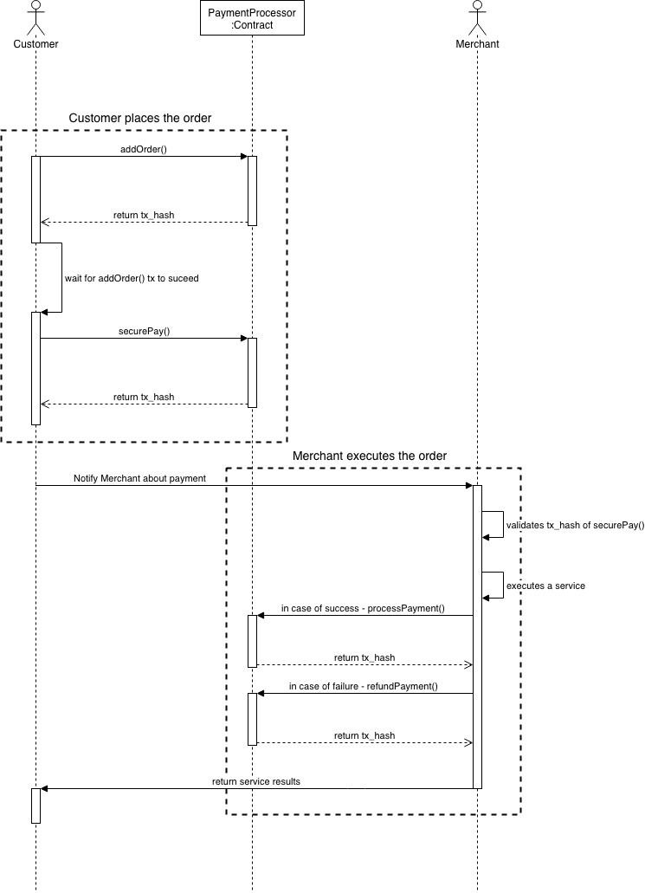
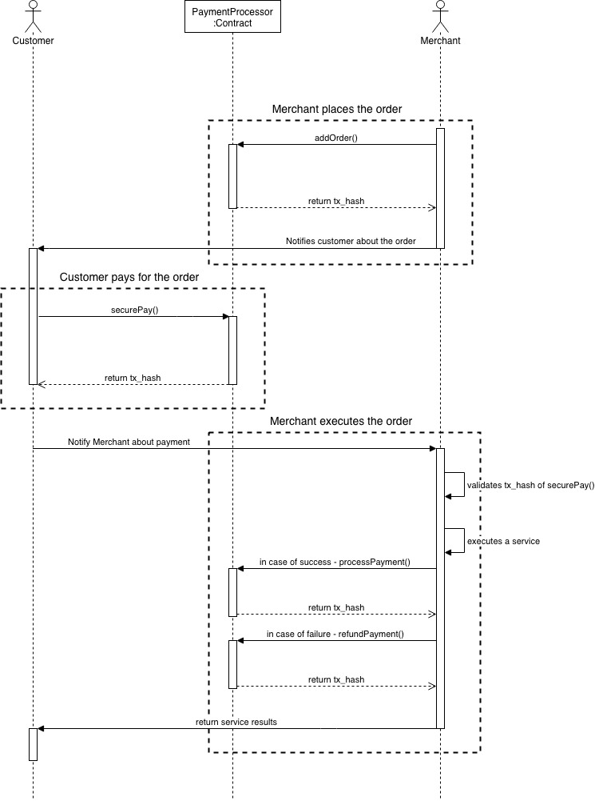

# MONETHA: Decentralized Reputation Framework <!-- omit in toc -->

## Payment Layer

- [Payment Layer](#payment-layer)
- [Abstract](#abstract)
  - [Key Principles](#key-principles)
  - [Payments Layer Design](#payments-layer-design)
- [Actors](#actors)
  - [Customer](#customer)
  - [Merchant](#merchant)
  - [Monetha](#monetha)
- [Implementation](#implementation)
  - [Merchant's Contracts](#merchants-contracts)
  - [Monetha's Contracts](#monethas-contracts)
- [De-centralized payment layer usage scenarios](#de-centralized-payment-layer-usage-scenarios)
  - [Payment flow initiated by Customer](#payment-flow-initiated-by-customer)
  - [Payment flow initiated by Merchant](#payment-flow-initiated-by-merchant)
  - [Implementation examples](#implementation-examples)
  - [Repositories](#repositories)
- [Token Usage and Loyalty program](#token-usage-and-loyalty-program)
  - [Paybacks](#paybacks)
    - [Voucher contract addresses](#voucher-contract-addresses)
  - [Tokenholder program](#tokenholder-program)
    - [How​ ​it​ ​works](#how%E2%80%8B-%E2%80%8Bit%E2%80%8B-%E2%80%8Bworks)
    - [Program lifecycle](#program-lifecycle)
    - [Tokenholder program contract addresses](#tokenholder-program-contract-addresses)
  - [Dispute resolution](#dispute-resolution)
    - [Dispute resolution flow](#dispute-resolution-flow)
    - [Claim handler contract addresses](#claim-handler-contract-addresses)
- [Forking the Payment Layer](#forking-the-payment-layer)

## Abstract

The Payments layer of Monetha's Reputation Framework is a decentralized orders processing layer based on enforceable smart contracts between the buyer and the seller (or service provider) with no involvement of a third party. It can be used alongside Monetha's Reputation layer or separately from it.

Merchants (for our purposes the term includes the providers of both digital or physical goods/services) are ​able​ ​to​ ​accept​ ​Ethereum​ ​based​ ​cryptocurrencies​.

### Key Principles

- Keep the payment process ​simple​ ​and​ cost ​efficient;
- Make​ ​order processing transparent for Customers;
- Make​ it easier for Merchants to ​accept ​crypto payments​;
- Bring​ ​the​​ ​Ethereum-based​ ​​token​ ​economy​​ ​to​ ​the​ ​​mainstream.

### Payments Layer Design

The design of the Payments layer resembles the escrow mechanism you would normally encounter in vending machines. There the customer's money is held in an "escrow area" until the transaction between the customer and the merchant, which results in an item exchange, is successfully completed. If a problem occurs and the merchant can no longer process the transaction, the customer can withdraw her funds. If no problem occurs, the funds are released to the merchant.

Our development is driven by the following principles:

- Open-source project;
- Misuse is easily detectable;
- User and developer friendly;
- Improvements are driven by the community via proposals, bug bounty and other means.

## Actors

### Customer

A person or entity that purchases goods or services. Depending on the use case this can be an application representing an entity or person. Customers:

- Can interact with Merchants either directly through the Ethereum network or via other communication interfaces (service provider 3rd party applications);
- Do not have any particular requirements and in the majority of cases can be a simple Ethereum address;
- Receive a payback for each purchase. It is equal to 0.2% from the purchase amount in Monetha vouchers and can be used for applying discount for other purchases using Monetha's Payments layer;
- Initiate the purchase flow.

### Merchant

A person or entity that provides goods or services and would like to receive payment in an Ethereum based crypto-currency. Merchants:

- Own a set of contracts representing their entity on the blockchain;
- Maintain their operations history on the blockchain;
- Trigger escrow to release funds in case of successful operations;
- Have control over refunding or canceling an order.

### Monetha

Monetha's role is to provide paybacks to Customers using the payment gateway and allow to build-up transferable reputation profile when used together with Reputation layer. Monetha:

- Provides a payback to all Customers making purchases from Merchants using Monetha's deployed and maintained MonethaGateway contract;
- Allows the application of customer discounts without the Merchant losing funds;
- Makes order processing flow transparent.

## Implementation

The implementation is designed in a decentralized manner to maintain a high level of trust between the parties.

### Merchant's Contracts

- MerchantWallet:
  - Accepts payments for orders;
  - Acts as a Merchant's profile and fund storage after payment is received;
  - *Source:* [MerchantWallet](https://github.com/monetha/payment-contracts/blob/master/contracts/MerchantWallet.sol).
- MerchantDealHistory:
  - Stores the hash of deal conditions between the Merchant and the Customer;
  - Shows a history of all transactions made by a particular Merchant;
  - Enables to see the evolution of reputation points for both parties.
  - The Merchant's deal history is used as a FactProvider in [reputation-layer](https://github.com/monetha/reputation-layer);
  - *Source:* [MerchantDealsHistory](https://github.com/monetha/payment-contracts/blob/master/contracts/MerchantDealsHistory.sol).
- PaymentProcessor:
  - Implementation of an escrow mechanism where Customers stake their money and wait for the goods/service to be exchanged;
  - The Customer can cancel the order;
  - The Merchant can refund the order after it has been processed;
  - The Customer can withdraw the refund after it was refunded by Merchant
  - *Source:* [PaymentProcessor](https://github.com/monetha/payment-contracts/blob/master/contracts/PaymentProcessor.sol).

### Monetha's Contracts

- MonethaGateway:
  - Ensures that Monetha receives a 1.5% fee to be able to cover paybacks and discounts;
  - Ensures that the Customer's applied discount gets transferred back to him or her;
  - Ensures that the Customer receives a payback of 0.2%;
  - *Source:* [MonethaGateway](https://github.com/monetha/payment-contracts/blob/master/contracts/MonethaGateway.sol).
- MonethaVoucher:
  - Allows MonethaGateway and other trusted parties to exchange vouchers into ether to return the discount amount to customers;
  - Registers and tracks the amount of vouchers that are emitted as paybacks to Customers;
  - *Source:* [MonethaVoucher](https://github.com/monetha/payment-contracts/blob/master/contracts/MonethaVoucher.sol).
- MonethaClaimHandler:
  - Allows Customer and Merchant to register their dispute on chain;
  - Multiple claims can be created for a deal;
  - Customer's and Merchant's MTH tokens needs to be staked for successful resolution
  - *Source:* [MonethaClaimHandler](https://github.com/monetha/loyalty-contracts/blob/master/contracts/MonethaClaimHandler.sol).

## De-centralized payment layer usage scenarios

Merchant can decide how to approach the order creation. `PaymentProcessor` contract allows to initiate the process by both Merchant and Customer

Flow consists of the following steps.

1. Order created on a chain with `addOrder()` method by either Merchant or Customer
2. Customer executes `securePay()` method which transfers the amount defined in an Order to the smart contract
3. Merchant ensures that goods are in stock or that he will be able to provide the service
4. Merchant executes `processPayment()` method to process funds and awaits for funds at `MerchantWallet`
5. Merchant sends out the goods to the Customer

The payment flow can be initiated in 2 ways:

- [flow initiated by Customer](#payment-flow-initiated-by-customer)
- [flow initiated by Merchant](#payment-flow-initiated-by-merchant)

### Payment flow initiated by Customer

### Payment flow initiated by Merchant

### Implementation examples

- Monetha's payment gateway [https://www.monetha.io/e-commerce](https://www.monetha.io/e-commerce)
- ICO pass analyzer [website](https://icoanalyzer.monetha.io)
  - Github repository for web application [https://github.com/monetha/ico-analyzer-web-app](https://github.com/monetha/ico-analyzer-web-app)
  - Github repository for analysis function run as AWS lambda [https://github.com/monetha/ico-analyzer](https://github.com/monetha/ico-analyzer)

### Repositories

- Payment smart contracts: [https://github.com/monetha/payment-contracts](https://github.com/monetha/payment-contracts)
- Loyalty smart contracts: [https://github.com/monetha/loyalty-contracts](https://github.com/monetha/loyalty-contracts)
- Payment GO SDK: [https://github.com/monetha/payment-go-sdk](https://github.com/monetha/payment-go-sdk)

## Token Usage and Loyalty program

Monetha MTH tokens are used throughout the payment layer and more applications are planned while using [Reputation layer](https://github.com/monetha/reputation-layer). Current MTH token applications can be seen in the following modules.

- Loyalty program
  - [Paybacks](#paybacks)
  - [Tokenholder program](tokehnholder-program)
- [Dispute resolution](#dispute-resolution)

There are multiple directions how MTH tokens are being utilized in Monetha's ecosystem. Two of the main directions are [Paybacks](#paybacks) and [Tokenholder program](tokehnholder-program) in combination referenced as Monetha's Loyalty program. Another MTH token application is for [Dispute resolution](#dispute-resolution). More token applications are to come while using our [Reputation layer](https://github.com/monetha/reputation-layer)

### Paybacks

Paybacks are being granted to all customer's who have made an Ether payment through Monetha's payment gateway. A customer receives a payback in Monetha Vouchers (aka MTHV). Each MTHV is backed by a MTH token. Payback voucher amount is locked at the capacity of MTH tokens staked in the MonethaVoucher contract by Monetha. A customer can then use those vouchers for discount up to 70% when purchasing through Monetha payment gateway.

Amount of vouchers granted to a user as a payback is converted according exchange rate that is being updated by Monetha on daily basis.

This is done with a help of a [MonethaVoucher](https://github.com/monetha/loyalty-contracts/blob/master/contracts/MonethaVoucher.sol) smart contract which is deployed to Ethereum mainnet and can be found at address [0x8D6b6F21e4519Ec10F54842CD9C113eE7e50E04a](https://etherscan.io/address/0x8D6b6F21e4519Ec10F54842CD9C113eE7e50E04a)

Monetha vouchers are valid for six months. If not used within that period, they will move back to their respective pools. Monetha vouchers are non transferable

#### Voucher contract addresses

| Network      | Address                                      |
|--------------|----------------------------------------------|
|Ropsten|[0xA76B86520F235A9b8Cc32c44D0f98565891Ae455](https://ropsten.etherscan.io/address/0xA76B86520F235A9b8Cc32c44D0f98565891Ae455)|
|Mainnet|[0x8D6b6F21e4519Ec10F54842CD9C113eE7e50E04a](https://etherscan.io/address/0x8D6b6F21e4519Ec10F54842CD9C113eE7e50E04a)|

### Tokenholder program

All people that have bought or received MTH tokens (aka tokenholders) are eligible to participate in a monthly tokenholders program. It is the program where Monetha stakes 1/3 of monthly revenue that was acquired via Monetha payment gateway and allows MTH tokenholder to ​claim​ ​for​ ​vouchers proportionately​ ​to​ ​the​ ​amount​ ​of​ ​MTH​ ​tokens​ ​that​ ​they​ ​hold.

This is done with a help of a [MonethaTokenHoldersProgram](https://github.com/monetha/loyalty-contracts/blob/master/contracts/MonethaTokenHoldersProgram.sol) smart contract which is deployed to Ethereum mainnet and can be found at address [0x4830e1e8D533313d2bb426cF1EF306460f288524](https://etherscan.io/address/0x4830e1e8D533313d2bb426cF1EF306460f288524)

#### How​ ​it​ ​works

- Let’s​ ​say​ ​we​ ​have​ ​1000​ ​investors​ ​as​ ​MTH​ ​holders,​ ​holding​ ​1​ ​MTH​ ​each.​ ​Now,​ ​all
token​ ​holders​ ​equally​ ​hold​ ​0.1%​ ​of​ ​the​ ​total​ ​token​ ​supply.
- Let’s​ ​say​ ​Monetha’s​ ​merchants​ ​sold​ ​100​ ​000​ ​ETH​ ​worth​ ​of​ ​goods​ ​and​ ​services​ ​in one​ ​month​ ​and​ ​let’s​ ​say​ ​that​ ​1ETH​ ​=​ ​1MTH.​ ​Because​ ​Monetha​ ​takes​ ​1.5% transaction​ ​fee​ ​from​ ​merchants,​ ​Monetha​ ​will​ ​have​ ​1500​ ​ETH​ ​of​ ​revenue​ ​collected.
- For​ ​this​ ​scenario,​ ​1⁄3​ ​of​ ​Monetha’s​ ​revenue​ ​means​ ​1⁄3​ ​of​ ​1500​ ​ETH​ ​=​ ​500​ ​ETH. Therefore,​ ​​ ​we​ ​will​ transfer ​500​ ​ETH​ to`MonethaTokenHoldersProgram` contract and initiate a purchase of MTHV tokens for that amount. As a result ​we get​ ​500​ ​MTH​V ​that​ ​is​ ​available​ ​to​ ​use​ ​for​ ​MTH​ ​holders​ ​in​ ​Monetha’s ecosystem.​ ​
- All​ ​1000​ ​MTH​ ​holders​ ​will​ ​equally​ ​have​ ​the​ ​ability​ ​to​ ​use​ ​500​ ​MTHV ​when​ ​shopping​ ​with​ ​Monetha’s​ ​merchants.​ ​In​ ​this​ ​case,​ ​one​ ​token​ ​holder will​ ​be​ ​able​ ​to​ ​spend​ ​up​ ​to​ ​0.1%​ ​of​ ​500​ ​MTH​ ​(=0.5​ ​MTH​ ​each).

#### Program lifecycle

1. Monetha transfers 1/3 of the revenue that were residing in temporary vault address [0x003a9f226b282539b161f8704b8dbc783c2f7860](https://etherscan.io/address/0x003a9f226b282539b161f8704b8dbc783c2f7860) to a [Monetha Tokenholder contract address](https://etherscan.io/address/0x4830e1e8D533313d2bb426cF1EF306460f288524)
2. In order to participate in the program tokenholders must transfer their MTH tokens on the 1st day of the month. To do so a person must: 
    1. Approve transfer of the tokens for the "Monetha Tokenholder program contract" from their address. This can be achieved by executing `approve()` on MTH token smart contract 
    2. Execute `participate()` method of the [Monetha Tokenholder contract](https://etherscan.io/address/0x4830e1e8D533313d2bb426cF1EF306460f288524)
3. After 1st day passes a tokenholder can execute `redeem()` method of the [Monetha Tokenholder contract](https://etherscan.io/address/0x4830e1e8D533313d2bb426cF1EF306460f288524) which will result in granting proportional share of MTHV for Monetha revenue share
4. Day before next month all of the vouchers will be converted into Ether and a new cycle will begin.

If revenue was not claimed it will be transferred to the next month and tokenholders will be able to claim it again.

Token holders can forfeit from the tokenholder program even if they already staked their tokens by executing `cancelParticipation()` method of the [Monetha Tokenholder contract](https://etherscan.io/address/0x4830e1e8D533313d2bb426cF1EF306460f288524)

#### Tokenholder program contract addresses

| Network      | Address                                      |
|--------------|----------------------------------------------|
|Ropsten|[0x06eb6a5b63968157DcEbE1A50E5e89F55BceF1B8](https://etherscan.io/address/0x06eb6a5b63968157DcEbE1A50E5e89F55BceF1B8)|
|Mainnet|[0x4830e1e8D533313d2bb426cF1EF306460f288524](https://etherscan.io/address/0x4830e1e8D533313d2bb426cF1EF306460f288524)|

### Dispute resolution

Whenever two parties have completed an exchange of goods or services they are eligible of registering a dispute on chain in case if one of the parties is unpleased with the deal's outcome.

Dispute registration and resolution is handled by `MonethaClaimHandler` smart contract. In order to register a dispute a Claim must be created. To create a Claim and participate in it's resolution both of the parties must have MTH tokens present in their accounts. MTH tokens will be staked in a smart contract during claim resolution process.

- Claim can be created by both parties;
- Multiple claims can be opened for the same object of dispute (aka Deal);
- A minimum amount of staked tokens is maintained by Monetha;

`MonethaClaimHandler` contract to be used for multiple purpose this is way main actors are called:

- Requester - party who started a claim to solve a dispute;
- Respondent - party who must respond to a claim for dispute resolution;

Reputation score changes are not managed by the contract and instead managed by Monetha as soon as Claim's state changes on a blockchain.

#### Dispute resolution flow

Dispute resolution flow can be described in the following steps:

1. Requester executes `approve()` operation on ERC20 contract for a MTH amount that will be staked for claim creation
2. Requester creates a claim by executing `create()`
3. Requester notifies Respondent that a claim is created on a blockchain
4. Respondent executes `approve()` operation on ERC20 contract for a MTH amount that was staked by Requester
5. Respondent executes `accept()` the Claim in 72 hours
6. Respondent solves the Claim with Respondent off-chain and comes to a conclusion in 72 hours time
7. Respondent sets agreed resolution on chain by executing `resolve()` and retrieves his staked MTH tokens
8. Respondent notifies a Requester about set resolution
9. Requester executes `close()` to confirm resolution and retrieves his staked MTH tokens

In case if resolution was not sufficient a new claim can be opened either by Requester or Respondent

#### Claim handler contract addresses

| Network      | Address                                      |
|--------------|----------------------------------------------|
|Ropsten|[0x06eb6a5b63968157DcEbE1A50E5e89F55BceF1B8](https://etherscan.io/address/0x06eb6a5b63968157DcEbE1A50E5e89F55BceF1B8)|
|Mainnet|TBD|

## Forking the Payment Layer

Our implementation can be forked or similar ones can be built.

The solutions are in favor of our implementation:

- Provide a valuable and useful solution;
- Offer paybacks and discounts maintained and guaranteed by Monetha.
